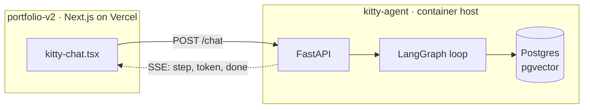

# kitty

[](https://github.com/vroslmend/kitty-agent/actions/workflows/ci.yml)

The on-site agent for [ammarhassan.dev](https://ammarhassan.dev). A LangGraph
tool-calling agent behind a FastAPI server, streaming its steps to a chat widget
in the portfolio.

It is an agent rather than a retrieval chatbot on purpose. Retrieval is one of
its tools, and the graph decides when to reach for it.

**Early.** The service boots, speaks SSE, rate limits itself and reports its
own health. There is no graph behind `/chat` yet, so every request returns the
napping fallback.

## Architecture



The backend is a separate repo and a separate deploy because it is a
long-running process and the portfolio is a static site. This mirrors
`cloud-visitor-counter`, which is also consumed client side.

## The loop

A ReAct loop, built by hand rather than with the prebuilt helper. The agent
node decides whether to answer or call a tool. If it called one, the results
are appended to the message list and it runs again with them in hand.


Retrieval is one of those tools. It is not the shape of the program.

## Run it

```bash
python -m venv .venv
./.venv/Scripts/python.exe -m pip install -e ".[dev]"   # Windows
cp .env.example .env
./.venv/Scripts/python.exe -m uvicorn app.main:app --reload
```

Then:

```bash
curl localhost:8000/health
curl -N -X POST localhost:8000/chat -H 'Content-Type: application/json' -d '{"message":"hello"}'
```

`-N` matters on the second one. Without it curl buffers and the stream looks
like a single blob.

## Tests

```bash
./.venv/Scripts/python.exe -m pytest
```

## Configuration

Everything is read once at boot through `pydantic-settings`. See `.env.example`.

| Variable | Purpose |
|---|---|
| `ENVIRONMENT` | Reported by `/health`. |
| `ALLOWED_ORIGINS` | Comma separated CORS origins. |
| `LLM_API_KEY` | Empty until the agent exists. Empty means `/chat` returns the napping fallback rather than an error. |
| `MAX_TOKENS_PER_REQUEST` | Cost ceiling. Declared, not yet enforced. |
| `RATE_LIMIT_PER_MINUTE` | Requests per client per minute on `/chat`. Enforced. Over it returns 429. |

## The `/chat` protocol

`POST /chat` with `{"message": str, "thread_id": str | None}` returns
`text/event-stream`. Each frame is one JSON object:

| `type` | Payload | Meaning |
|---|---|---|
| `step` | `label` | The agent started doing something. Renders as a chip. |
| `token` | `text` | A piece of the answer. |
| `done` | `thread_id` | Finished. Send this `thread_id` back to continue the conversation. |
| `error` | `message` | Something failed. |

Over the rate limit, `/chat` returns `429` with a JSON body rather than a
stream, and a `Retry-After` header. `/health` is not rate limited, or the
platform's own probes would consume the allowance.

This shape is the contract. What produces the events will change; the events
will not, so the widget can be written against them now.

## Deploy

Any container host that builds a Dockerfile. Railway and Render both do this
from a connected repo with no extra configuration.

1. Create the service and point it at this repo.
2. Set the environment variables above. `ALLOWED_ORIGINS` must include the
   portfolio's production origin.
3. The host injects `PORT`; the container already binds it.
4. Point the health check at `/health`.

Then set `NEXT_PUBLIC_KITTY_API_URL` in the portfolio to the deployed URL. Unset
means the widget stays hidden, the same convention the visitor counter and
now-playing widget use.
