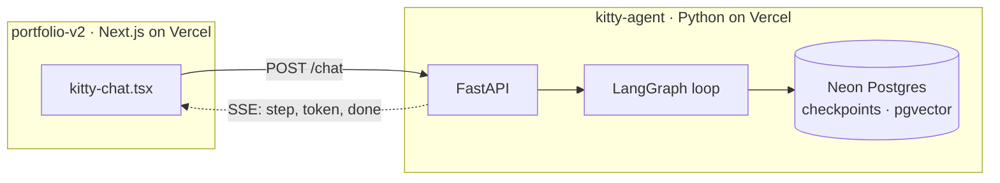
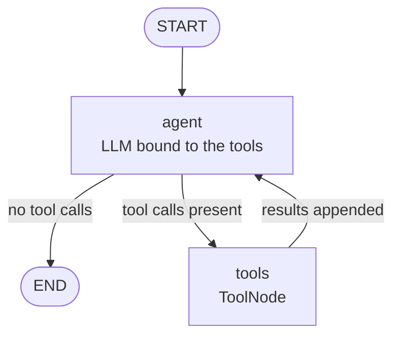

# kitty

[](https://github.com/vroslmend/kitty-agent/actions/workflows/ci.yml)

The on-site agent for [ammarhassan.dev](https://ammarhassan.dev). A LangGraph
tool-calling agent behind a FastAPI server, streaming its steps to a chat widget
in the portfolio.

It is an agent rather than a retrieval chatbot on purpose. Retrieval is one of
its tools, and the graph decides when to reach for it.

**In progress.** The agent answers over `/chat`, streams its steps, remembers
across turns, has all five tools, and pauses to ask which one you meant when a
question is vague. Still to come: the harness that scores the golden set, and
the widget.

## Architecture



Two repos and two deploys. The portfolio is a static Next.js site and this is a
Python service, so they have nothing to share but an HTTP contract. It mirrors
`cloud-visitor-counter`, which is also consumed client side.

Both halves run on Vercel, but as separate projects. This one is a single
Python function, so it holds no state between requests and conversation memory
lives in Postgres rather than in the process.

## The loop

A ReAct loop, built by hand rather than with the prebuilt helper. The agent
node decides whether to answer or call a tool. If it called one, the results
are appended to the message list and it runs again with them in hand.



Retrieval is one of those tools. It is not the shape of the program.

Drive it directly, without the API in front:

```bash
./.venv/Scripts/python.exe -m app.agent "which of his projects use terraform?"
```

It prints each decision as it happens, so a wrong tool choice is visible rather
than buried in the final answer.

## Tools

A tool's docstring is the contract the model reads to decide whether to call
it, so each one also names the neighbouring tool to use instead. The near-miss
pairs are what routing actually gets wrong: asking where his GitHub is wants a
link, not a list of his recent commits.

| Tool | Answers |
|---|---|
| `list_projects` | What he has built, filtered by stack, year or keyword. |
| `suggest_navigation` | Where something lives on the site, as a path to link to. |
| `get_now_playing` | What he is listening to, or last listened to. |
| `get_github_activity` | What he has pushed recently. |
| `search_writing` | His essays, over pgvector. |
| `ask_clarification` | Nothing. It stops the run and asks the visitor which one they meant. |

The two that reach the network return a sentence on failure rather than
raising. The model can relay that GitHub is rate limiting to a visitor; it can
do nothing useful with a traceback.

`list_projects` and `suggest_navigation` read `app/data/site.json`, which is
generated from the portfolio rather than written twice:

```bash
node scripts/sync_site_content.mjs
```

Re-run it when the portfolio's projects or writing change.

## Evals

`evals/dataset.jsonl` holds 46 golden questions written against the real site,
each with the tools that should fire and the traits the answer needs. It was
written before the tools existed so it would shape their design rather than
ratify it.

Nineteen of the 46 expect no tool call at all. An agent that reaches for a tool
on every turn is a common failure, and half the routing skill is knowing when
not to. The rest cover the near-miss pairs, prompt injection, questions it
should refuse to guess at, and one case that only means anything with the
network unplugged.

The harness that scores it is not built yet. See `evals/README.md`.

## Run it

```bash
python -m venv .venv
./.venv/Scripts/python.exe -m pip install -e ".[dev]"   # Windows
cp .env.example .env
./.venv/Scripts/python.exe -m app.db setup              # once, creates the tables
./.venv/Scripts/python.exe -m app.rag.ingest            # once, builds the index
./.venv/Scripts/python.exe -m app.serve
```

Use `app.serve` rather than calling uvicorn directly. Uvicorn creates its event
loop before importing the application, and psycopg's async mode will not run on
Windows' default loop, so the policy has to be set before uvicorn starts. The
symptom otherwise is every question answering "something went wrong on my end".
Linux is unaffected, and Vercel imports the app itself.

`app.serve` also refuses to start when the port is busy. Windows honours
`SO_REUSEADDR` far enough to let a second server bind a port a live one is
already listening on, and then connections go to whichever the kernel picks. Set
`PORT` to run more than one.

Then:

```bash
curl localhost:8000/health
curl -N -X POST localhost:8000/chat -H 'Content-Type: application/json' -d '{"message":"hello"}'
```

`-N` matters on the second one. Without it curl buffers and the stream looks
like a single blob.

## Tests

```bash
./.venv/Scripts/python.exe -m pytest
```

Nothing in the suite calls a model or the network. The tests deliberately do
not read `.env`, so they run on the same defaults CI sees. To check a change
the way CI will, move `.env` aside first.

## Configuration

Everything is read once at boot through `pydantic-settings`. See `.env.example`.

| Variable | Purpose |
|---|---|
| `ENVIRONMENT` | Reported by `/health`. |
| `ALLOWED_ORIGINS` | Comma separated CORS origins. |
| `LLM_API_KEY` | Empty means `/chat` returns the napping fallback rather than an error. |
| `LLM_MODEL` | Default `gemini-3.5-flash-lite`. See below. |
| `DATABASE_URL` | Neon, pooled. Checkpoints and pgvector. |
| `NOW_PLAYING_URL` | The portfolio's Spotify proxy, so the refresh token lives in one place. |
| `GITHUB_USERNAME` / `GITHUB_TOKEN` | The token is optional and needs no scopes. Without it GitHub allows 60 requests an hour shared across every visitor. |
| `SITE_BASE_URL` | The portfolio's origin. |
| `MAX_TOKENS_PER_REQUEST` | Cost ceiling, applied as the model's output cap. |
| `RATE_LIMIT_PER_MINUTE` | Requests per client per minute on `/chat`. Enforced. Over it returns 429. |

The model default is a constraint, not a preference. Every full Gemini Flash
model allows 20 requests a day on the free tier, which one pass over the golden
set would exhaust and which no public endpoint could serve. The Lite models
allow 500 a day. Quotas are per model, so the eval harness gets to decide what
that costs in answer quality.

## The `/chat` protocol

`POST /chat` with `{"message": str, "thread_id": str | None}` returns
`text/event-stream`. Each frame is one JSON object:

| `type` | Payload | Meaning |
|---|---|---|
| `step` | `label` | The agent started doing something. Renders as a chip. |
| `token` | `text` | A piece of the answer. |
| `question` | `text`, `options` | The agent stopped to ask which one. Reply on the same thread. |
| `done` | `thread_id` | Finished. Send this `thread_id` back to continue the conversation. |
| `error` | `message` | Something failed. |

Over the rate limit, `/chat` returns `429` with a JSON body rather than a
stream, and a `Retry-After` header. `/health` is not rate limited, or the
platform's own probes would consume the allowance.

The limit is counted twice: once in process, and once in Postgres. In process
alone is wrong on serverless, where the real allowance would be the limit
multiplied by however many instances happen to be warm. The shared count is a
single statement holding a per-client advisory lock, so instances racing on the
same client cannot each read the same under-limit count and both admit a
request. If the database is unreachable the in-process window still applies:
degraded to per instance, never absent.

A turn ends on either an answer or a `question`, and `done` follows both. When
it ends on a question the run is paused rather than finished: it is sitting in
the checkpointer mid tool call, and the next `POST /chat` on that `thread_id`
is the reply. There is no resume flag and no second endpoint, because the
server can see from the saved state that the thread is waiting. Whatever the
visitor sends is handed back as the paused tool's result and the run carries on
from where it stopped.

This shape is the contract. What produces the events will change; the events
will not, so the widget can be written against them now.

## Deploy

Vercel, as its own project pointed at this repo. The FastAPI preset finds
`app/main.py` on its own, so no build configuration is needed. `vercel.json`
only caps the function duration and keeps tests and fixtures out of the bundle.

1. Import the repo at [vercel.com/new](https://vercel.com/new) with no
   environment variables. An empty `LLM_API_KEY` means the service comes up in
   the napping fallback and cannot call a model, so a first deploy proves the
   hosting without exposing anything.
2. Attach Neon from the project's Storage tab. It writes `DATABASE_URL` in.
3. Add `LLM_API_KEY`, and set `ALLOWED_ORIGINS` to the portfolio's origin.

The Dockerfile is kept for local runs and portability. It is not what Vercel
builds, and the service is deliberately host agnostic: it binds `PORT` and
holds no local state, so a container host is a fallback rather than a rewrite.

Then set `NEXT_PUBLIC_KITTY_API_URL` in the portfolio to the deployed URL. Unset
means the widget stays hidden, the same convention the visitor counter and
now-playing widget use.
