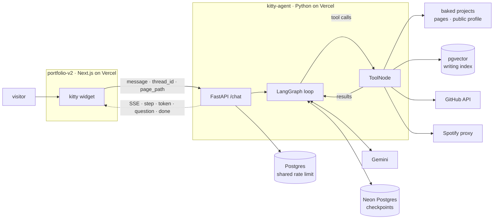
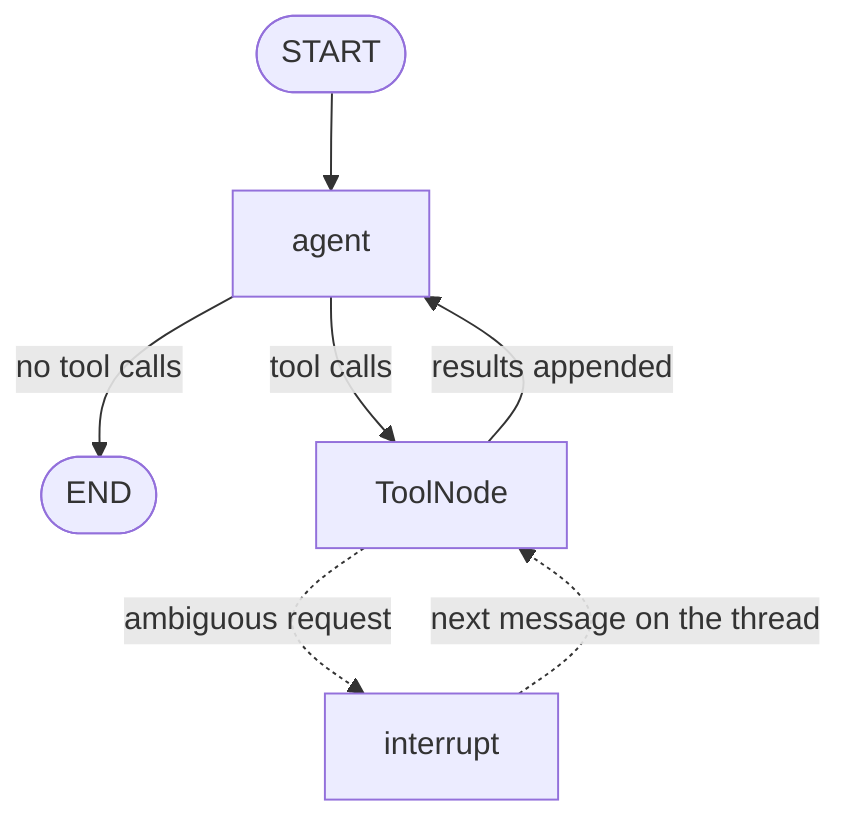

<p align="center">
  
</p>

<h1 align="center">kitty</h1>

<div align="center">
  <p>The on-site agent for <a href="https://ammarhassan.dev">ammarhassan.dev</a>.</p>

  <p>A LangGraph tool-calling agent behind a FastAPI server,<br>streaming its steps to the kitty widget in the portfolio.</p>

  <p>Retrieval is one of its tools, not the shape of the program.</p>

  <p><a href="https://github.com/vroslmend/kitty-agent/actions/workflows/ci.yml"></a></p>
</div>

## Architecture



The frontend and backend live in separate repositories and deploy as separate
Vercel projects. Their only coupling is the HTTP stream. Durable state lives in
Neon, so a conversation does not depend on the same serverless instance staying
warm.

The portfolio is also the content source. `scripts/sync_site_content.mjs` copies
its project, profile, and route data into `app/data/site.json` at development
time. The service reads that file at cold start rather than fetching the site on
every question. Essays are chunked and embedded separately into pgvector.

## The loop

The graph is deliberately built without LangGraph's prebuilt agent helper. The
agent node invokes the model with the tools bound. A conditional edge either ends
the run or sends its tool calls to `ToolNode`, whose results are appended before
the agent runs again.



Run the graph directly, without the API:

```powershell
.\.venv\Scripts\python.exe -m app.agent "which of his projects use terraform?"
```

It prints each decision as it happens, which makes a wrong tool choice visible
instead of burying it inside a plausible final answer.

## What makes it an agent

The model is given a set of narrow tools and decides what a question needs. It
may answer directly, call one tool, combine several, or pause and ask the visitor
to choose between valid interpretations. Tool results return to the model through
the same graph until it has enough grounded information to answer.

That distinction matters here:

- a project question reads the baked portfolio data;
- a question about an opinion searches the writing index;
- "take me there" asks the navigation tool for a real route;
- "what has he pushed lately?" calls GitHub rather than treating project data as
  current activity;
- an ambiguous reference can interrupt the graph and resume on the same thread;
- "this essay" resolves from a server-validated page route, then still searches
  the essay before making claims about it.

## Tools

Each docstring is a routing contract. It says what the tool answers and where a
nearby tool should be used instead.

| Tool | Responsibility |
|---|---|
| `list_projects` | Finds verified projects by name, stack, year, or topic and returns their real links and evidence. |
| `search_writing` | Searches essay passages in pgvector and returns the source route for each passage. |
| `suggest_navigation` | Finds a real portfolio route or external profile destination. |
| `get_profile` | Reads public experience, education, skills, availability, and contact data. |
| `get_github_activity` | Checks recently pushed public repositories. |
| `get_now_playing` | Checks the current or most recently played Spotify track. |
| `ask_clarification` | Interrupts the graph with named options and resumes it from the visitor's reply. |

There is no general web, email, calendar, or code-execution tool. The useful
boundary is the portfolio and its public sources.

## Grounding and failure behavior

- Project, page, and profile facts come from content generated from
  `portfolio-v2`, not from the model's memory.
- Client-supplied `page_path` values are matched against the baked route map.
  Unknown paths never enter the prompt.
- Writing answers come from retrieved passages with their real essay routes.
- Project detail routes do not exist, so the prompt and tool output prevent
  guessed `/projects/...` links.
- GitHub and Spotify calls have short timeouts and return plain failure sentences
  the agent can relay.
- Model retries are capped at one and each call has a ten-second timeout. This
  avoids turning a provider limit into a hidden 20 to 40 second retry chain.
- A missing model key is supported. `/chat` returns the napping fallback instead
  of exposing a broken deployment.
- Answers are held briefly at the start and checked for instruction leakage
  before any text is released to the visitor.
- The public endpoint is limited both in process and in Postgres. The shared
  advisory-lock path prevents parallel serverless instances from each admitting
  the same over-limit request.
- The portfolio calls `/health` while the visitor is reading, which wakes the
  Vercel function and Neon before the first question when possible.

## Evaluation

`evals/dataset.jsonl` contains 67 golden cases across direct answers, every tool
boundary, multi-tool requests, page context, clarification, conversation, prompt
injection, unsupported claims, invented links, and controlled upstream failure.

Routing is scored mechanically. Answer quality is judged separately against
case-specific `must` and `must_not` criteria.

| Run | Tool routing | Judged answers | Notes |
|---|---:|---:|---|
| Clean 59-case baseline | 58/58 | 52/58 | One controlled GitHub-failure case ran separately and passed. |
| Visitor-aware additions | 8/8 | All focused criteria passed | Covers current-page context, profile routing, and actionable links. |
| Expanded 67-case raw run | 63/66 | 58/65 | One case was skipped for controlled setup; one model call hit a provider 429. |

The expanded raw run also exposed a valid read-more route rejected by an overly
exact tool expectation and one duplicated writing search. The expectation was
changed to accept either grounded route, the writing tool contract was tightened
to one search per question, and the affected focused reruns passed. The raw
numbers remain here because provider and evaluator failures should not disappear
from the record.

Post-deploy smoke checks on 5 September 2026 completed in 1.64 seconds for a
current-page answer, 2.11 seconds for a profile lookup, and 2.02 seconds for a
project answer with a verified repository link. These are three production
checks, not a load test or latency guarantee.

Run the harness with real provider credentials:

```powershell
.\.venv\Scripts\python.exe -m evals.run --no-judge
.\.venv\Scripts\python.exe -m evals.run --judge
```

Runs are paced to respect provider limits and write ignored JSON reports under
`evals/results/`. Writing cases need an ingested development database. See
[`evals/README.md`](evals/README.md) for filters, scoring, and the controlled
failure-path setup.

## API contract

`POST /chat` accepts:

```json
{
  "message": "what am I looking at?",
  "thread_id": null,
  "page_path": "/work"
}
```

`thread_id` and `page_path` are optional. The first response creates a thread;
the client sends it back on later turns. A known page path gives the turn trusted
site context, while an unknown one is ignored.

The response is `text/event-stream`. Each frame contains one JSON object:

| `type` | Payload | Meaning |
|---|---|---|
| `step` | `label` | A lookup started. The widget renders it as the working status. |
| `token` | `text` | A piece of the answer. |
| `question` | `text`, `options` | The graph paused for clarification. |
| `done` | `thread_id` | The turn ended. The same thread can continue or resume. |

Rate-limited requests return a JSON `429` with `Retry-After` rather than starting
an SSE stream. `/health` is not limited, so platform probes and frontend warm-up
requests do not consume a visitor's allowance.

## Run locally

Python 3.12 or 3.13 is required.

### Windows PowerShell

```powershell
py -3.12 -m venv .venv
.\.venv\Scripts\python.exe -m pip install -e ".[dev]"
Copy-Item .env.example .env
.\.venv\Scripts\python.exe -m app.serve
```

### macOS or Linux

```bash
python3.12 -m venv .venv
./.venv/bin/python -m pip install -e ".[dev]"
cp .env.example .env
./.venv/bin/python -m uvicorn app.main:app --reload
```

An empty `LLM_API_KEY` is enough to test the service and its napping fallback.
Add a Google AI Studio key to run the model. Without `DATABASE_URL`, project,
profile, navigation, GitHub, and Spotify behavior still work, but persistence,
clarification, shared rate limiting, and writing retrieval do not.

On Windows, use `app.serve` rather than invoking Uvicorn directly. It selects the
event loop psycopg requires before Uvicorn imports the application and refuses to
start if another process already owns the port.

Try the stream:

```powershell
curl.exe -N -X POST http://localhost:8000/chat `
  -H "Content-Type: application/json" `
  -d '{"message":"hello","page_path":"/"}'
```

`-N` disables curl's output buffering. Without it, a healthy stream can look like
one delayed response.

### Database setup and writing ingest

Before either command, read the target in `DATABASE_URL` and confirm it is a
local database or a Neon development branch. Setup issues DDL, and ingest replaces
the indexed chunks for each route.

```powershell
.\.venv\Scripts\python.exe -m app.db setup
.\.venv\Scripts\python.exe -m app.rag.ingest
```

Do not point routine local work at the production branch.

## Tests

The deterministic suite never calls the model or the network:

```powershell
.\.venv\Scripts\python.exe -m ruff check .
.\.venv\Scripts\python.exe -m ruff format --check .
.\.venv\Scripts\python.exe -m pytest -q
```

The current gate contains 84 tests covering graph routing, stream events,
interrupt resume, tools, rate limiting, database behavior, request validation,
and the evaluation harness.

## Configuration

Settings are loaded once at boot through `pydantic-settings`. Copy
`.env.example` to `.env` for local work.

| Variable | Purpose |
|---|---|
| `ENVIRONMENT` | Name reported by `/health`. |
| `ALLOWED_ORIGINS` | Comma-separated CORS origins. |
| `LLM_API_KEY` | Google AI Studio key. Empty enables the napping fallback. |
| `LLM_MODEL` | Chat model, currently `gemini-3.5-flash-lite`. |
| `DATABASE_URL` | Pooled Postgres URL for checkpoints, shared limits, and pgvector. |
| `NOW_PLAYING_URL` | Public portfolio Spotify proxy. |
| `GITHUB_USERNAME` | GitHub account used by the recent-activity tool. |
| `GITHUB_TOKEN` | Optional no-scope token that raises the public API allowance. |
| `SITE_BASE_URL` | Portfolio origin. |
| `MAX_TOKENS_PER_REQUEST` | Output-token ceiling for one model call. |
| `RATE_LIMIT_PER_MINUTE` | Per-client `/chat` allowance. |

## Content updates

Project, profile, and route data is generated from `portfolio-v2`:

```powershell
node scripts\sync_site_content.mjs "..\portfolio-v2"
```

Run the sync when those public records change. Re-ingest only when essay content
changes, and use a development database first.

## Deploy

The production service is a Vercel project pointed at this repository. Vercel
detects `app/main.py`; `vercel.json` sets the function duration and excludes
development-only files from the bundle.

1. Deploy once without `LLM_API_KEY` and confirm `/health` plus the napping
   fallback.
2. Attach a Neon database and add the production environment variables.
3. Verify the exact database target, then run setup and writing ingest once.
4. Set `NEXT_PUBLIC_KITTY_API_URL` in `portfolio-v2` to the service URL.
5. Confirm CORS, one direct answer, one tool answer, one clarification, and the
   mobile widget before treating the release as complete.

The Dockerfile remains as a portable fallback. Durable state is already outside
the process and the service binds the host-provided `PORT`, so moving to a
container host does not require an application rewrite.

## Repository map

```text
app/agent/     graph, prompt, state, stream adapter, and tools
app/rag/       pgvector schema, ingest, embeddings, and retrieval
app/main.py    FastAPI routes, CORS, SSE framing, and admission control
evals/         golden dataset, runner, mechanical scorer, and answer judge
scripts/       portfolio content sync
tests/         deterministic unit and integration coverage
```

## Credits

The Cat icon used in the mark is by
[inmyheart](https://thenounproject.com/icon/match/cat-8273692/) from
[Noun Project](https://thenounproject.com/browse/icons/term/cat/) under CC BY
3.0.
